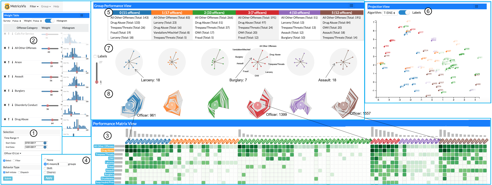

How to use activity records to evaluate the performance of employees? MetricsVis is designed to support dynamic performance evaluation for individuals, teams, and the organization.

{:width="750px"}

